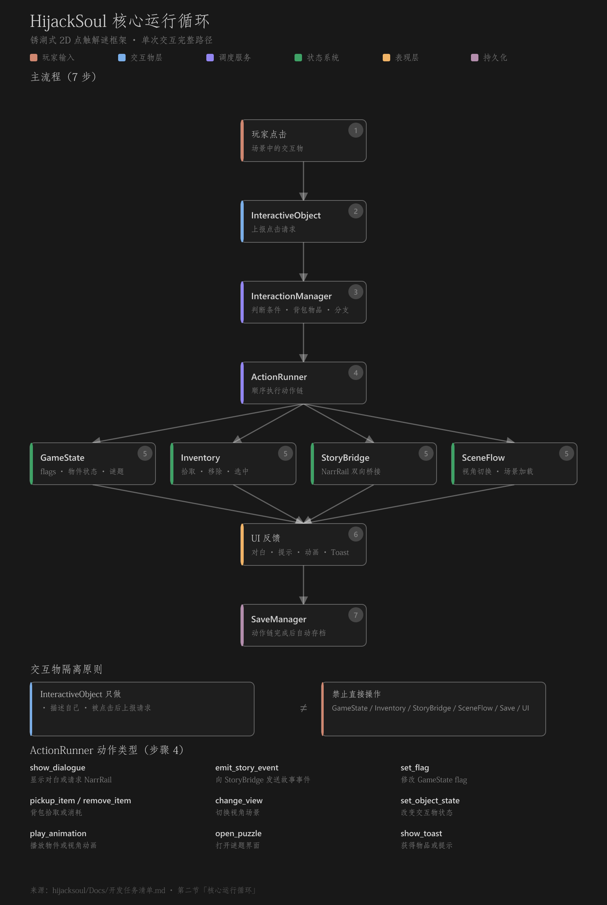

# 程序开发任务清单

本文档用于跟踪 HijackSoul 的 Godot 框架验证阶段。当前目标是先完成一套适合“锈湖式 2D 点触解谜体验”的可堆量开发框架。

当前验收基准分辨率：`1280x720`。

## 一、框架目标

- [x] 支持 2D 场景/视角切换。
- [x] 支持在 Godot 场景中直接拖拽摆放交互物。
- [x] 支持交互物 Inspector 配置，接近 UE 蓝图基类的使用方式。
- [x] 支持物品点击、拾取、使用、触发事件。
- [x] 支持 NarrRail 对白最小接入。
- [x] 支持 NarrRail event 操控游戏 action。
- [x] 支持交互后自动存档。
- [ ] 支持完整读档恢复演示。
- [ ] 支持谜题/小游戏入口和完成回调。
- [ ] 支持策划批量堆量时的配置校验工具。

## 二、核心运行循环

```text
玩家点击交互物
-> InteractiveObject 上报点击请求
-> InteractionManager 判断条件和当前背包物品
-> ActionRunner 执行动作链
-> 更新 GameState / Inventory / StoryBridge / SceneFlow
-> UI 播放反馈和提示
-> SaveManager 自动保存
```



- [x] `InteractiveObject` 上报点击。
- [x] `InteractionManager` 分发交互。
- [x] `ActionRunner` 执行动作链。
- [x] `GameState` 保存 flags 和交互物状态。
- [x] `InventoryManager` 保存背包和选中物品。
- [x] `StoryBridge` 接 NarrRail。
- [x] `SaveManager` 在动作链完成后自动保存。

## 三、基础系统

### 1. EventBus

- [x] 建立全局事件总线。
- [x] 支持交互请求事件。
- [x] 支持 hover 开始/结束事件。
- [x] 支持背包拾取、移除、选中事件。
- [x] 支持 story event 请求。
- [x] 支持自动存档请求。

### 2. GameState

- [x] 保存当前 `view_id`。
- [x] 保存 flags。
- [x] 保存交互物状态。
- [x] 保存谜题状态字段。
- [x] 提供 snapshot 创建和恢复接口。
- [ ] 完整演示读档后自动恢复当前视角和所有表现状态。

### 3. SaveManager

- [x] 使用 `user://autosave.json`。
- [x] 保存 GameState。
- [x] 保存 InventoryManager。
- [x] 支持自动保存。
- [x] 支持读档接口。
- [x] 支持清档接口。
- [ ] 保存和恢复 StoryBridge/NarrRail snapshot。
- [ ] 做游戏内读档按钮和验收流程。

### 4. SceneFlowManager

- [x] 支持 `view_id -> scene_path` 注册。
- [x] 支持 `change_view` action 直接传 `scene_path`。
- [x] prototype 正面视角和左侧视角可互相切换。
- [ ] 抽屉/近景等第三视角验证。
- [ ] 切换黑场遮罩。
- [ ] 异步 loading 图标。

### 5. InteractionManager

- [x] 接收交互物请求。
- [x] 根据当前选中背包物品选择分支。
- [x] 无动作/无效情况给出 warning。
- [ ] 条件判断：`visible_condition`。
- [ ] 条件判断：`enabled_condition`。
- [ ] 错误物品使用的统一玩家反馈。

### 6. ActionRunner

- [x] `show_dialogue`
- [x] `emit_story_event`
- [x] `set_flag`
- [x] `pickup_item`
- [x] `remove_item`
- [x] `change_view`
- [x] `set_object_state`
- [x] `open_puzzle`
- [x] `show_toast`
- [ ] `play_animation`
- [ ] action 失败时的玩家可见反馈。

### 7. InventoryManager

- [x] 管理背包物品。
- [x] 管理当前选中物品。
- [x] 支持拾取、移除、选中、取消选中。
- [x] 支持存档 snapshot。
- [x] 支持侧边背包 UI。
- [ ] 支持物品图标资源配置。
- [ ] 支持物品详情/查看。

### 8. StoryBridge

- [x] 接入 `NarrRailSession`。
- [x] 游戏 `emit_story_event` 可启动 prototype `.nrstory`。
- [x] 接收 NarrRail `line_changed`。
- [x] 接收 NarrRail `choices_changed` 的 UI 通道。
- [x] 接收 NarrRail `event_emitted` 并转成游戏 action。
- [ ] 接入 `NarrRailOutlineRunner`。
- [ ] StoryBridge snapshot 纳入 SaveManager。
- [ ] 正式 story event 映射配置资源化。

## 四、场景与视角框架

### 1. RoomView

- [x] 建立 `RoomView` 基类。
- [x] 进入视角时写入当前 `view_id`。
- [x] 收集并恢复子交互物状态。
- [x] 支持进入视角时执行 `enter_actions`。
- [ ] 统一 RoomView 场景模板。
- [ ] 房间/章节级视角注册表。

### 2. Prototype 视角

- [x] 正面视角：`prototype_room_front.tscn`。
- [x] 左侧视角：`prototype_room_left.tscn`。
- [x] 正面到左侧切换热点。
- [x] 左侧到正面切换热点。
- [ ] 抽屉近景视角。
- [ ] 多房间切换验证。

### 3. 场景生产规则

- [x] 位置和层级由 Godot scene 保存。
- [x] 交互物使用稳定唯一 `object_id`。
- [x] prototype 已有热点尺寸配置测试。
- [ ] 自动检查重复 `object_id`。
- [ ] 自动检查缺失 `CollisionShape2D`。
- [ ] 自动检查过小热点区域。

## 五、交互物框架

### 1. InteractiveObject

- [x] 建立 `interactive_object.gd`。
- [x] 建立 `interactive_object.tscn`。
- [x] 自带 `Sprite2D`。
- [x] 自带 `CollisionShape2D`。
- [x] 根节点 Inspector 可调 `sprite_texture`。
- [x] 根节点 Inspector 可调 `hotspot_size`。
- [x] 支持 hover 高亮。
- [x] 支持 tooltip 事件。
- [x] 支持拾取后立即隐藏。
- [x] 支持按 `object_id` 恢复状态。
- [x] 复杂动作链改用 Resource 配置。
- [ ] 交互物编辑器校验。

### 2. 常用交互预制体

- [x] 通用 `interactive_object.tscn`。
- [x] `pickup_object.tscn`。
- [x] `view_exit_object.tscn`。
- [x] `story_trigger_object.tscn`。
- [x] `puzzle_entry_object.tscn`。
- [x] `locked_object.tscn`。

### 3. 快捷配置字段

- [x] `pickup_item_id`
- [x] `target_view_id`
- [x] `story_event_on_click`
- [x] `puzzle_id`
- [x] `default_actions`
- [x] `item_interactions`
- [x] `target_scene_path`
- [x] `toast_message`
- [x] `required_item_id`
- [x] `missing_item_toast_message`
- [x] `consume_required_item`
- [x] `set_flag_on_success`
- [x] `state_on_success`
- [x] 根据快捷字段自动生成更完整的 action 链。

## 六、NarrRail 对接

### 1. 对白播放

- [x] prototype `.nrstory` 可加载。
- [x] 点击 `WallNote` 可触发 NarrRail 对白。
- [x] 底部 DialoguePanel 显示 speaker/text。
- [x] `Next` 可推进 MultiDialogue。
- [x] UI 已预留 choices 按钮生成逻辑。
- [ ] 用真实本地化文本表替代直接显示 `textKey`。
- [ ] 选项分支实际 demo。

### 2. 故事事件驱动游戏

- [x] NarrRail `EmitEvent` 可触发 `set_flag`。
- [x] NarrRail `EmitEvent` 可触发 `show_toast`。
- [ ] `give_item`
- [ ] `remove_item`
- [ ] `change_view`
- [ ] `unlock_object`
- [ ] `lock_object`
- [ ] `open_puzzle`

### 3. 游戏事件推进故事

- [x] `emit_story_event("inspect_wall_note")` 已跑通。
- [ ] 谜题完成触发故事事件。
- [ ] 关键物品获得触发故事事件。
- [ ] 多 story/outline 管理。

### 4. 存档整合

- [ ] SaveManager 保存 NarrRail snapshot。
- [ ] SaveManager 恢复 NarrRail snapshot。
- [ ] 读档后恢复当前对白/选项状态。

## 七、背包与拾取系统

- [x] 建立侧边背包 UI。
- [x] 背包栏固定在右侧。
- [x] 支持物品按钮。
- [x] 支持选中/取消选中。
- [x] 支持拾取提示 toast。
- [x] 支持选中钥匙打开锁盒。
- [x] 支持消耗钥匙。
- [ ] 支持图标显示。
- [ ] 支持物品排序。
- [ ] 支持物品详情查看。

## 八、谜题/小游戏框架

- [x] `open_puzzle` action 预留。
- [ ] 谜题入口交互物 demo。
- [ ] 独立 puzzle scene 打开/关闭。
- [ ] `puzzle_completed(puzzle_id)` 事件。
- [ ] 谜题完成后设置 GameState flag。
- [ ] 谜题完成后触发 NarrRail event。
- [ ] 谜题状态进入存档并恢复。

## 九、演出与 UI

### 1. 分辨率与布局

- [x] 当前验收分辨率固定为 `1280x720`。
- [x] 右侧背包栏固定为 `128px`。
- [x] toast、tooltip、debug 文本避开背包栏。
- [ ] 多分辨率适配策略。
- [ ] 移动端/窗口缩放策略。

### 2. 场景切换

- [ ] 黑场遮罩。
- [ ] Loading 图标。
- [ ] 切换目标提示。

### 3. 交互反馈

- [x] 鼠标悬停高亮。
- [x] 名称 Tooltip。
- [x] 拾取提示 toast。
- [ ] 点击无效反馈。
- [ ] 使用错误物品反馈。

### 4. 对白 UI

- [x] 显示 NarrRail 对白。
- [x] 支持点击 Next。
- [x] 支持选项按钮结构。
- [x] 支持对白中触发事件。
- [ ] 正式视觉样式。
- [ ] 打字机效果。
- [ ] 关闭/跳过策略。

### 5. 调试 UI

- [x] 显示当前选中物品。
- [x] 显示部分 prototype 状态。
- [ ] 显示当前 `view_id`。
- [ ] 显示全部 flags。
- [ ] 显示最近触发事件。
- [ ] Save/Load/Clear 按钮。

## 十、2D 动画技术方案

- [x] 交互物 hover 变亮。
- [ ] 交互物状态动画使用 AnimationPlayer。
- [ ] RoomView 一次性演出 AnimationPlayer。
- [ ] 动画结束后写入 GameState。
- [ ] 读档后恢复 animation_state。

## 十一、最小验证 Demo

### 已完成

- [x] 一个房间正面视角。
- [x] 一个房间左侧视角。
- [x] 视角互相切换。
- [x] 一个可拾取测试物品。
- [x] 一个可拾取钥匙。
- [x] 一个需要钥匙打开的锁盒。
- [x] 空手点锁盒提示锁住。
- [x] 选中钥匙点锁盒会消耗钥匙并打开。
- [x] 一个 NarrRail 对白触发物。
- [x] NarrRail event 改变游戏 flag。
- [x] 自动存档文件生成。
- [x] smoke test 覆盖基础交互、物品使用、NarrRail。
- [x] scene config test 覆盖关键热点尺寸。

### 未完成

- [ ] 第三个近景视角。
- [ ] 谜题入口和完成回调。
- [ ] 退出游戏后读档恢复当前视角。
- [ ] 已拾取物品读档后保持隐藏的完整手动验收。
- [ ] 背包物品读档后正确恢复的完整手动验收。
- [ ] NarrRail 对白进度读档恢复。
- [x] 所有核心交互支持无需手写 Dictionary 的 Resource/快捷字段配置方式。

## 十二、阶段拆分

### 阶段 1：基础闭环

- [x] 建 EventBus、GameState、SaveManager 骨架。
- [x] 建 SceneFlowManager 和 RoomView 基类。
- [x] 建 InteractiveObject 基类。
- [x] 实现点击、hover、tooltip、基础 action。
- [x] 实现一个视角内的查看和拾取。

### 阶段 2：背包与物品使用

- [x] 建 InventoryManager。
- [x] 建侧边背包 UI。
- [x] 支持选中物品点击交互物。
- [x] 支持物品消耗。
- [ ] 完善无效使用反馈。

### 阶段 3：视角切换与状态恢复

- [x] 实现多个 RoomView 切换。
- [x] 交互物按 object_id 恢复状态。
- [ ] 实现场景切换黑场和 loading。
- [ ] 完成读档恢复当前视角验收。

### 阶段 4：NarrRail 桥接

- [x] 接入 NarrRail 对白 UI。
- [x] 游戏交互触发 NarrRail event。
- [x] NarrRail event 转成游戏 action。
- [ ] 存档整合 NarrRail snapshot。
- [ ] 接入 outline。

### 阶段 5：谜题框架

- [x] 预留 open_puzzle action。
- [ ] 实现 open_puzzle 统一入口。
- [ ] 实现谜题完成回调。
- [ ] 谜题状态进入 GameState 和存档。

### 阶段 6：生产工具与规范

- [x] 初步改善交互物 Inspector 配置体验。
- [ ] 增加重复 object_id 检查。
- [ ] 增加缺失资源、缺失 action、无效 view_id 检查。
- [ ] 增加场景制作文档。
- [x] 将常用交互物拆成预制体。

## 十三、暂缓事项

- [ ] 不制作正式剧情内容。
- [ ] 不制作正式美术资产。
- [ ] 不实现复杂 AI、战斗、伤害公式。
- [ ] 不过早设计大量谜题类型。
- [ ] 不强制 Excel 驱动场景摆放；场景位置和层级优先由 Godot scene 保存。
